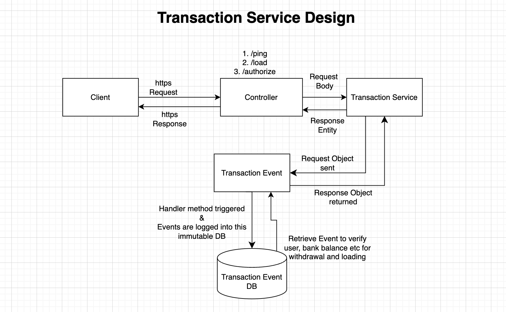
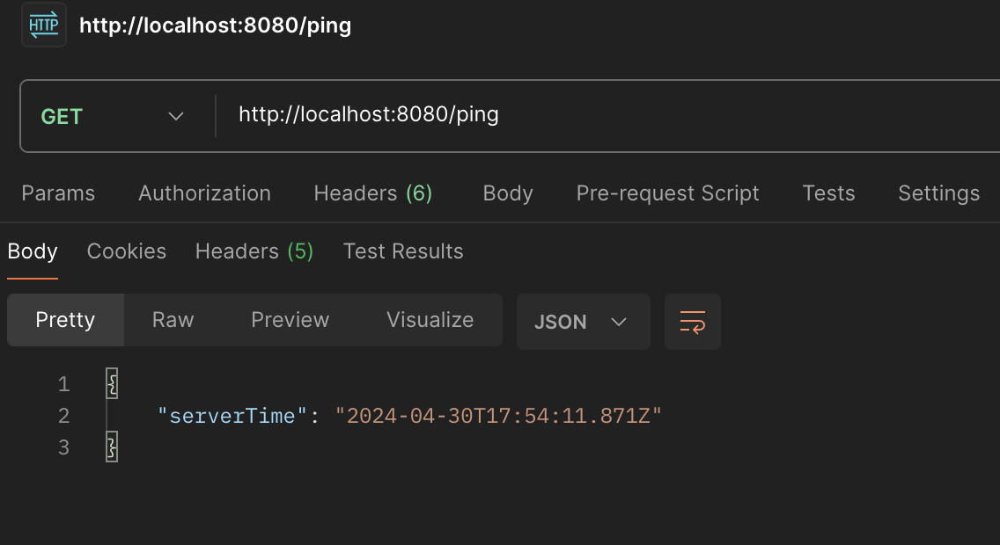
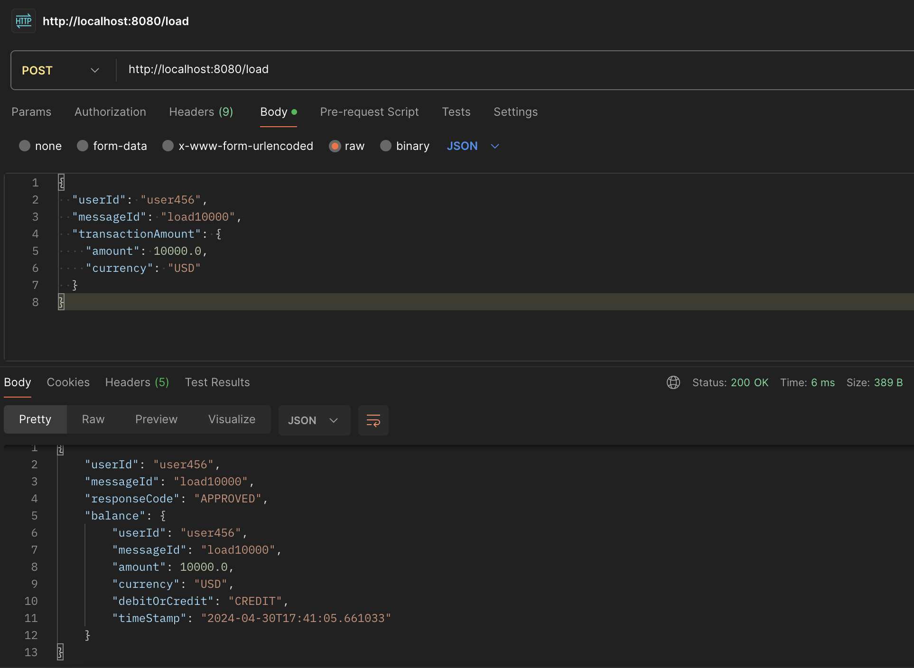
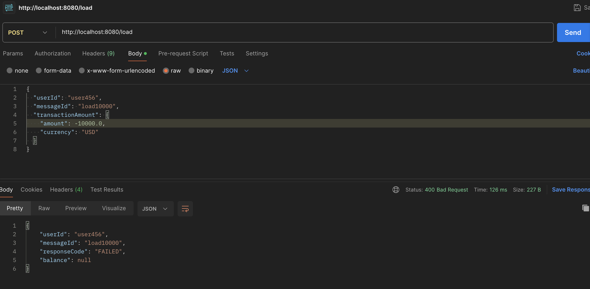
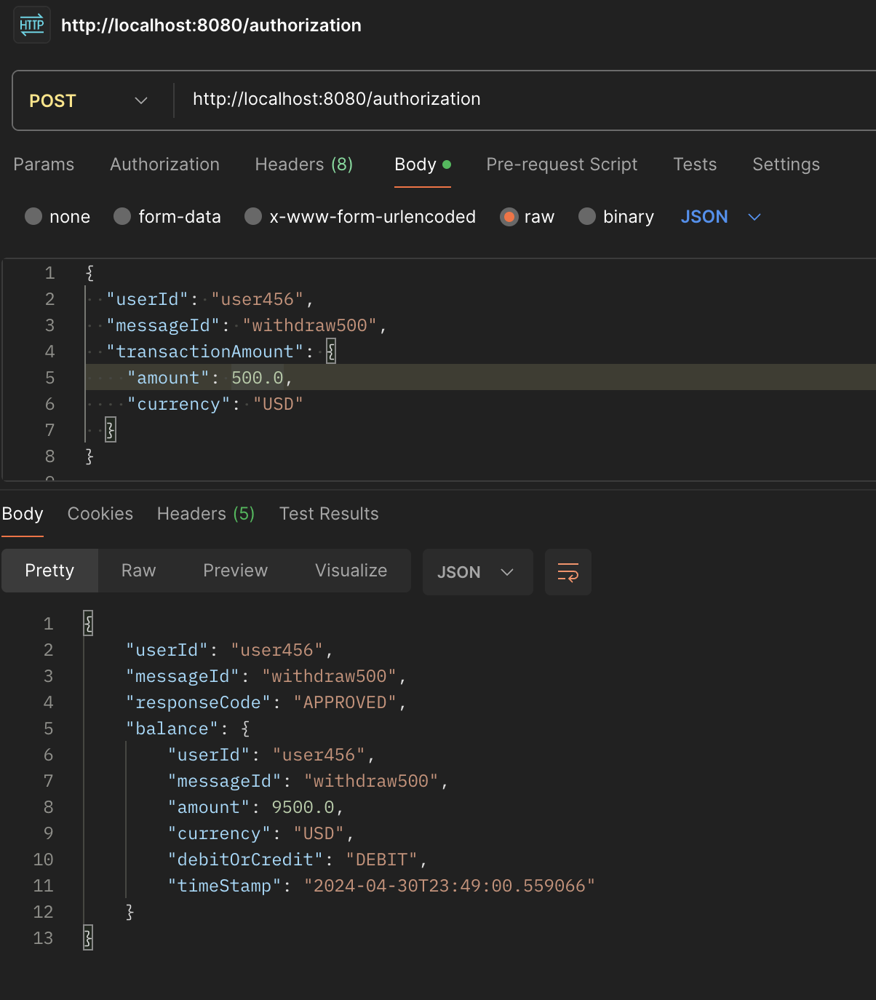
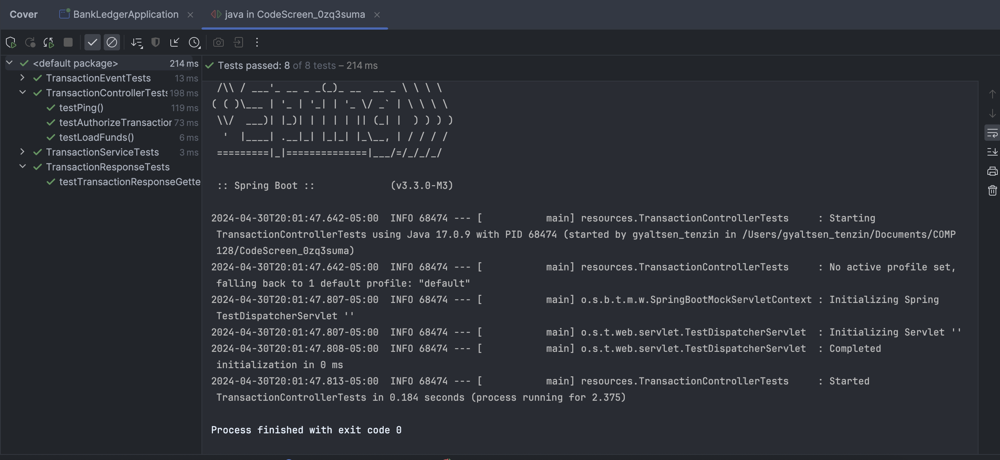
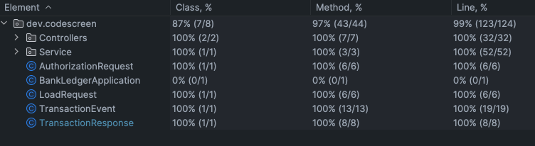

## Overview

Building a simple bank ledger system that maintain a transaction history. The system should allow users to perform basic banking operations such as depositing funds, withdrawing funds, and checking balances. The ledger should maintain a complete and immutable record of all transactions, enabling auditability and reconstruction of account balances at any point in time.

## Details

The [included service.yml](service.yml) is the OpenAPI 3.0 schema to a service we would like you to create and host.

The service accepts two types of transactions:

1. Loads: Add money to a user (credit)

2. Authorizations: Conditionally deduct money from a user (debit)

Every load or authorization PUT should return the updated balance following the transaction. Authorization declines should be saved, even if they do not impact balance calculation.

Implement the event sourcing pattern to record all banking transactions as immutable events. Each event should capture relevant information such as transaction type, amount, timestamp, and account identifier.
Define the structure of events and ensure they can be easily serialized and persisted to a data store of your choice.

## Instructions

To run this server locally, follow these steps:

1. **Clone the repository**:
   ```bash
   git clone [URL to your repo]
   cd [repository name]
   ```
2. **Building the Project and Running it**:
   - to install the dependencies (maven)
   ```bash
    mvn clean install
   ```
   - run it in an IDE (IntelliJ recommended)
     - Run the BankLedgerApplication class
   - If you have IntelliJ Pro version, you may be automatically suggested to test your code by plugins such as redocly when you open service.yml file, it has issues since it persistently runs on port 6343 rather default 8080 port
3. **Testing the Code / Sending Request to the Server**
   - Use PostMan Application by sending request to
   ```bash
   http://localhost:8080/ping
   ```
   - If you are interested in running it in the terminal
   ```bash
   curl -X POST http://localhost:8080/load \
     -H "Content-Type: application/json" \
     -d '{
           "userId": "user456",
           "messageId": "load10000",
           "transactionAmount": {
             "amount": 10000.0,
             "currency": "USD"
           }
         }'
   ```

## Design considerations

- I chose to build the transaction service using **Spring Boot** due to its extensive support for quickly developing RESTful services and its seamless handling of dependency injection.
- Additionally, I utilized the **OpenAPI specification** to ensure that the API documentation remains up-to-date and can be easily used with tools like Swagger for testing.
- Before building the service, I identified the necessary endpoints and the key methods that needed to be coded. Following this, I drafted a rough list for my system.
- During the development, I used **Spring's Controller** to create endpoints for HTTPS requests.
- If I were designing an entire banking system for a bank, I would include this service as a **microservice** to develop it more efficiently and independently.
- I adhered to **RESTful principles** to design intuitive and standard APIs, utilizing methods like GET, POST, PUT, and DELETE appropriately.
- Given the relative simplicity of this assignment, I did not focus extensively on error handling. Typically, it is crucial to build comprehensive error handling for all services and their handler methods, and to test them rigorously.
- I employed **Test-Driven Development** (TDD) to build the service. I wrote key tests first and then iterated on the development of this service.
- **Scalability**: By deploying on service such as AWS, the service can be scaled to handle increased load, perhaps using load balancers or scaling out the microservice instances.
- **Security**: For robust security measures such as HTTPS, JWTs for secure transmission, and data encryption should be considered to protect sensitive transaction data.
- **Continuous Integration/Continuous Deployment (CI/CD)**: CI/CD practices could be integrated to automate testing and deployment of the service, ensuring smoother transitions from development to production.
- **Monitoring and Logging**: Describe the strategies for monitoring service performance and logging critical events, which are essential for maintaining the reliability and availability of the service.
- **Compliance and Regulatory Considerations**: For a customer facing service, the data sharing and use cases should adhere to financial regulations and standards, which is critical for banking applications.



<figcaption>Figure : This is a screenshot of the overall design of the system</figcaption>

## Assumptions

- **User Authentication**: It is assumed that user authentication is handled externally, and this service requires a valid user token to process requests.
- **Currency Handling**: All transactions are assumed to be in USD.
- **Data Validation**: Basic data validation rules are assumed for all inputs to prevent SQL injection and ensure the integrity of the data.
- **DataBase**: It is assumed that the Events data are stored on a Relational DataBase
- **User Accounts**: It is assumed the user already has an account when making load request, and can perform authorization request after a load request has been made on a user.
- **Over Draft**: It is assumed that the bank does not allow overdraft.

## Bonus: Deployment considerations

For deployment, I would containerize the application using Docker for easy scalability and deployment. Kubernetes could be used to manage the container orchestration, ensuring high availability and load balancing. The application would be deployed on a cloud platform like AWS or Azure to leverage their managed services for databases, caching, and so on, ensuring optimal performance and reliability.

- **Cloud Services**: Utilize AWS EC2 for servers, RDS for managed database services, and S3 for logging and backups.
- **Continuous Integration/Continuous Deployment (CI/CD)**: Set up pipelines using Jenkins or GitHub Actions to automate testing and deployments.

## Endpoint Testing: Photos

  
_Figure 1: This is a screenshot of ping request test from PostMan._<br></br>

  
_Figure 2: This is a screenshot of loading request test from PostMan for valid amount._<br></br>

  
_Figure 3: This is a screenshot of loading request test from PostMan for negative amount._<br></br>

  
_Figure 4: This is a screenshot of authorization request test from PostMan._<br></br>

## Unit Testing & Code Coverage: Photos

  
_Figure 5: This is a screenshot of unit test and integration test._<br></br>

  
_Figure 6: This is a screenshot of code coverage after writing unit test and integration tests._<br></br>
